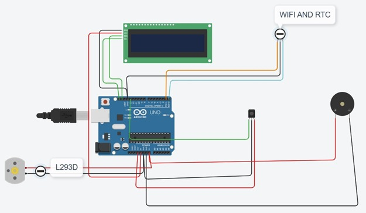
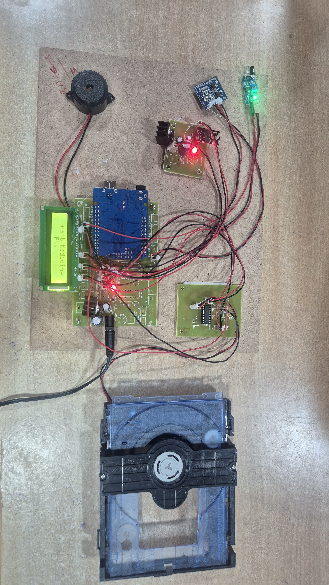
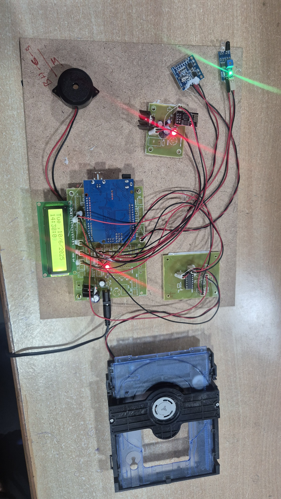
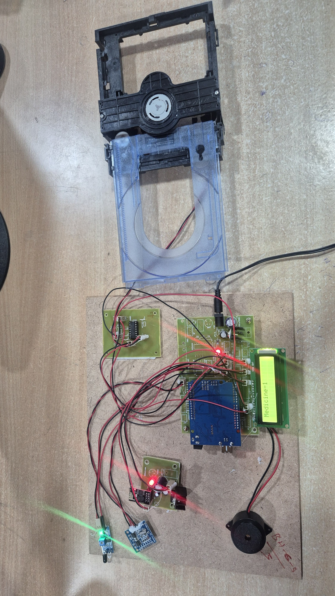

# 💊 IoT Smart Medicine Box

An IoT-enabled automatic medicine dispenser that reminds users to take medicine on time and notifies them if they miss a dose.

---

## 🧰 Components Used

- NodeMCU (ESP8266)
- Servo Motor
- IR Sensor
- Buzzer
- Jumper Wires
- Breadboard
- Medicine Box Casing
- IFTTT Webhooks

---

## 🔧 Working Principle

1. At the set time, a buzzer alerts the user.
2. The medicine box opens using a servo motor.
3. An IR sensor checks if the user picks the medicine.
4. If the medicine is **not taken within 10 seconds**, a mobile notification is sent using **IFTTT**.
5. The box then automatically closes.

---

## 🌐 Notification Setup (IFTTT)

- Create a free IFTTT account.
- Create an event named: `missed_medicine`
- Use **Webhooks** as trigger and **Notifications** as the action.
- Paste your IFTTT Webhook key into the `main.ino` Arduino code.

---

## 🖼️ Circuit Diagram

---

## 📸 Project Prototype Images

### 🧩 Power Supply

### 🔌 Circuit Setup (Connecting to Wi-Fi)

### 📦 Box Opening with Buzzer Ringing

---

## 🚀 How to Run the Project

1. Connect all components as shown in the circuit diagram.
2. Flash the `main.ino` code to your NodeMCU using Arduino IDE.
3. Update your Wi-Fi and IFTTT webhook info in the code.
4. Power the device.
5. At set times, test the alert and notification system by skipping or taking the medicine.

---

## 👩‍💻 Author

**Poojitha Reddy**  
GitHub: [@PoojithaReddy99123](https://github.com/PoojithaReddy99123)

---

> 🚑 Designed to assist elderly and forgetful patients in taking medicines on time. Built using IoT for real-world healthcare impact.
