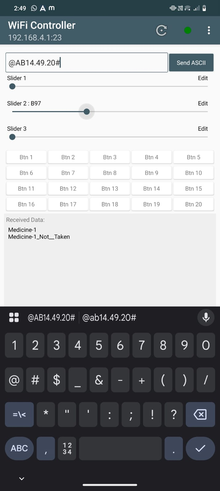

# 💊 IoT Smart Medicine Box

An Arduino-based automatic medicine dispenser that alerts users to take medicine on time using a buzzer and motorized box. It uses an IR sensor to detect if medicine is picked and connects to a **mobile Wi-Fi controller app** for remote monitoring and control.

---

## 🧰 Components Used

- Arduino UNO  
- RTC Module (Real Time Clock)  
- IR Sensor  
- LCD Display (16x2)  
- Buzzer  
- Motor (for CD tray mechanism)  
- Wi-Fi Controller App (for user interface)  
- Jumper Wires & PCB  
- Power Supply  

---

## 🔧 Working Principle

1. The RTC module tracks the time.  
2. At a preset time, a buzzer rings to alert the user.  
3. The medicine box (CD tray) opens automatically via motor.  
4. An IR sensor checks if the user picks up the medicine.  
5. If the medicine is **not taken**, it logs the miss and can show notification via the Wi-Fi controller app.  
6. The box closes after a few seconds.  

---

## 📱 Mobile Wi-Fi Controller App

  
*Interface of the mobile app used to control or monitor the smart medicine box wirelessly.*

---

## 🖼️ Circuit Diagram

---

## 📸 Project Prototype Images

### 🧩 Power Supply  

### 🔌 Circuit Setup (Connecting to Controller)  

### 📦 Box Opening with Buzzer Ringing  

---

## 🚀 How to Run the Project

1. Assemble the circuit as per the diagram.  
2. Flash the provided Arduino code (`main.ino`) using **Arduino IDE**.  
3. Set alarm times inside the code.  
4. Install and connect the mobile Wi-Fi controller app to your Arduino setup.  
5. Power the system and test real-time alerts, IR detection, and tray control.

---

## 📂 Project Structure
IoT-based-smart-medicine-box/
├── main.ino
├── circuit_diagram.jpg
├── wifi_controller.jpg
├── power_supply.jpg
├── connecting_to_wifi.jpg
├── box_opening_and_buzzer_rings.jpg
└── README.md

---

## 👩‍💻 Author

**Poojitha Reddy**  
GitHub: [@PoojithaReddy99123](https://github.com/PoojithaReddy99123)

---

> 🚑 Designed to support elderly and busy users in taking medicine on time through IoT automation and real-time feedback.